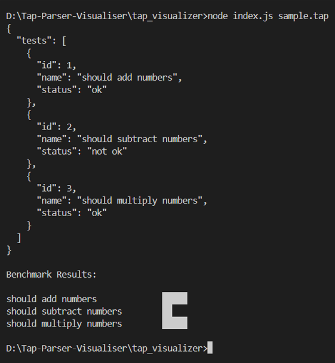

# TAP Visualizer

A simple CLI tool to parse TAP (Test Anything Protocol) output and visualize results.

## Architecture

TAP → Parser → Middleware → Visualizer

## Features
- TAP parsing
- Middleware transformation layer
- CLI visualization

## Usage
node index.js sample.tap

## Future Work
- Full TAP spec support
- YAML diagnostics parsing
- Faceted charts

